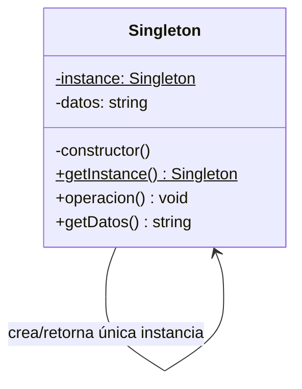
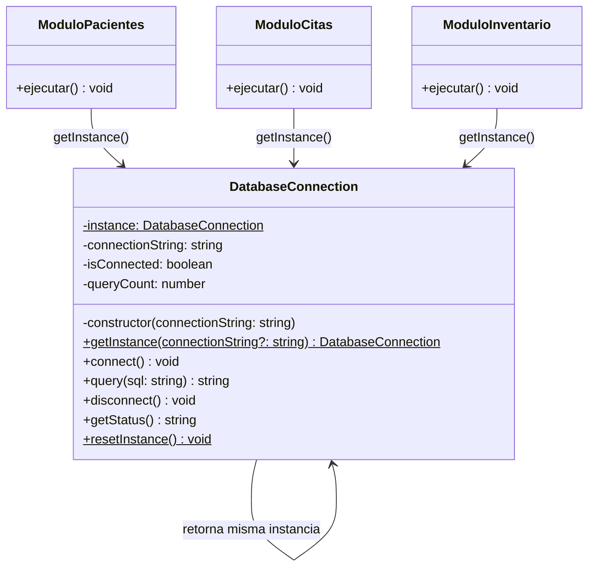

# Patrón de Diseño: Singleton
**Asignatura:** Programación Orientada a Objetos — Nivel 3A  
**Docente:** Edgardo Panchana  
**Estudiante:** Vale  
**Lenguaje:** TypeScript  

---

## 1. Concepto del Patrón

El **Singleton** es un patrón de diseño **creacional** que garantiza que una clase tenga **una única instancia** durante toda la ejecución del programa, y proporciona un punto de acceso global a dicha instancia.

> "Asegura que una clase tenga una sola instancia y proporciona un punto de acceso global a ella." — GoF (Gang of Four)

### Características clave
| Característica | Descripción |
|---|---|
| **Tipo** | Creacional |
| **Constructor privado** | Impide instanciar la clase con `new` desde afuera |
| **Instancia estática** | La clase guarda su propia instancia en un atributo estático |
| **Método `getInstance()`** | Punto de acceso global; crea la instancia solo si no existe |

---

## 2. Diagrama de Clases — Patrón Singleton (genérico)



---

## 3. Problemas que resuelve

- **Instancias duplicadas costosas:** conexiones a bases de datos, pools de hilos, gestores de configuración.
- **Estado compartido inconsistente:** varios objetos deberían ver los mismos datos en todo momento.
- **Control de acceso a recursos:** impresoras, archivos de log, caches.
- **Variables globales no controladas:** el Singleton reemplaza las variables globales con una alternativa orientada a objetos.

---

## 4. Problema Planteado

### Contexto
Un **sistema hospitalario** gestiona tres módulos: *Pacientes*, *Citas* e *Inventario*. Cada módulo necesita acceder a la base de datos. Si cada módulo crea su propia conexión:

- Se desperdician recursos del servidor (conexiones son costosas).
- Los contadores de queries quedan desincronizados.
- Es difícil hacer un cierre ordenado de la conexión.

### Solución con Singleton
Se implementa `DatabaseConnection` como Singleton: todos los módulos llaman a `DatabaseConnection.getInstance()` y obtienen **siempre la misma conexión**.

---

## 5. Diagrama de Clases — Problema Planteado



---

## 6. Estructura del Proyecto

```
singleton/
├── src/
│   ├── DatabaseConnection.ts   ← Clase Singleton
│   └── main.ts                 ← Demostración y pruebas
├── tsconfig.json
├── package.json
└── README.md
```

---

## 7. Instalación y Ejecución

```bash
# 1. Instalar dependencias
npm install

# 2. Compilar TypeScript
npx tsc

# 3. Ejecutar
node dist/main.js
```

### Salida esperada

```
╔══════════════════════════════════════════════╗
║  Sistema Hospitalario — Patrón Singleton     ║
╚══════════════════════════════════════════════╝

===== Módulo de Pacientes =====
[Singleton] Instancia creada con: hospital_db://localhost:5432
[DB] Conexión establecida → hospital_db://localhost:5432
[Query #1] Ejecutado: "SELECT * FROM pacientes WHERE activo = true"
[Query #2] Ejecutado: "SELECT nombre, edad FROM pacientes WHERE id = 42"
Estado: Conexión: hospital_db://localhost:5432 | Activa: true | Queries realizados: 2

===== Módulo de Citas =====
[Singleton] Instancia ya existente — reutilizando.
[Query #3] Ejecutado: "SELECT * FROM citas WHERE fecha = '2026-06-08'"
Estado: Conexión: hospital_db://localhost:5432 | Activa: true | Queries realizados: 3

===== Módulo de Inventario =====
[Singleton] Instancia ya existente — reutilizando.
[Query #4] Ejecutado: "SELECT medicamento, cantidad FROM inventario WHERE stock < 10"
Estado: Conexión: hospital_db://localhost:5432 | Activa: true | Queries realizados: 4

===== Verificación de Unicidad =====
¿Las tres referencias apuntan al mismo objeto? → true

[DB] Conexión cerrada correctamente.
Fin del programa.
```

---

## 8. Explicación del Código

### Constructor privado
```typescript
private constructor(connectionString: string) { ... }
```
Nadie puede hacer `new DatabaseConnection()` desde afuera. Esto **fuerza** el uso de `getInstance()`.

### Atributo estático
```typescript
private static instance: DatabaseConnection | null = null;
```
La clase "recuerda" su propia instancia a nivel de clase, no de objeto.

### Método getInstance()
```typescript
public static getInstance(connectionString = "hospital_db://localhost:5432"): DatabaseConnection {
    if (DatabaseConnection.instance === null) {
        DatabaseConnection.instance = new DatabaseConnection(connectionString);
    }
    return DatabaseConnection.instance;
}
```
- Primera llamada → crea la instancia.
- Llamadas siguientes → devuelve la misma.

---

## 9. Recursos Bibliográficos

- https://refactoring.guru/design-patterns/singleton
- Gamma, E. et al. (1994). *Design Patterns: Elements of Reusable Object-Oriented Software*. Addison-Wesley.